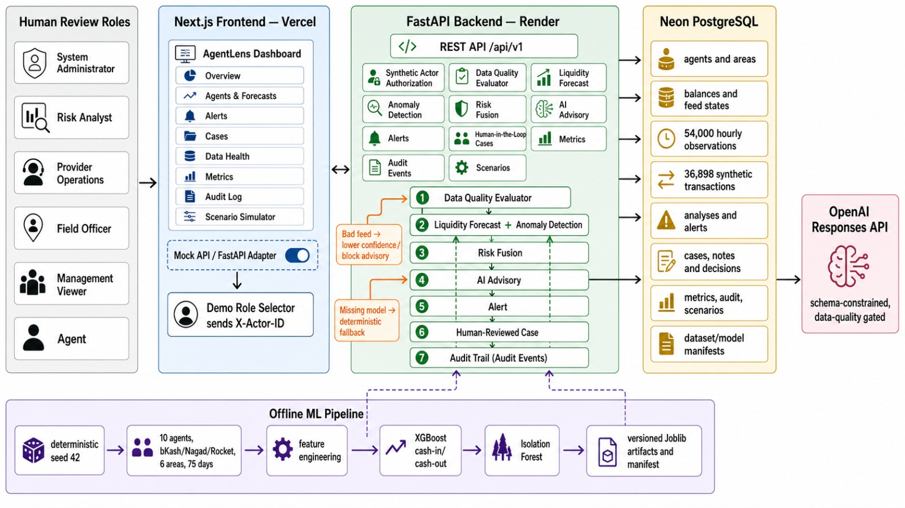

# AgentLens

AgentLens is a responsible decision-support prototype for synthetic multi-provider mobile-financial-service (MFS) agent operations. It forecasts provider and shared-cash liquidity, detects explainable unusual activity, and routes important alerts into authorized human-review cases.

---

## 📋 Required Deliverables (Codex Community Hackathon)

This section maps the prototype's implementation directly to the required hackathon deliverables.

### 1. Working Prototype
* **What judges should see:** A live flow showing multi-provider balances, a liquidity or anomaly alert, and how one important case is coordinated or escalated.
* **Judge Demonstration Path:**
  1. **Overview Dashboard:** Open the Overview tab and show the shared physical cash alongside the logically separate provider totals (bKash, Nagad, Rocket).
  2. **Shortage Forecasts:** Open `AGENT-104` to review individual provider balances, shared-cash forecast, shortage timing, forecast confidence, and forecast limitations.
  3. **Explainable Anomalies:** Run analysis to view measured anomaly evidence, cautious phrasing, Bengali explanations, uncertainty scores, and deterministic advisory fallback behavior.
  4. **Authorized Case Workflow:** Open the linked case, select a synthetic role (e.g. Nagad Ops), assign the case, acknowledge it, add an audit note, record a human decision, and resolve or escalate the case.
  5. **Metrics & Audit Logs:** Open the Audit Log to trace the workflow and the Metrics page to show metrics availability, samples, versioning, and execution timestamps.
* **Core Implemented Features:**
  - Separate bKash, Nagad, and Rocket balances plus agent-scoped shared physical cash.
  - Provider and shared-cash shortage forecasts with confidence, limitations, and deterministic fallback.
  - Explainable anomaly detection for velocity, repeated amounts, peer-volume deviation, liquidity concentration, and failure rates.
  - Provider-specific data-quality blocking (one unhealthy provider feed does not invalidate a healthy provider).
  - Structured optional OpenAI advisory with deterministic fallback when no key is configured.
  - Provider- and agent-scoped alerts, cases, assignment, acknowledgement, notes, decisions, escalation, resolution, dismissal, and audit history.
  - Synthetic role-based identities and server-approved capabilities.
  - Versioned forecast/anomaly evaluation snapshots and persisted workflow metrics.
  - English and structured Bengali alert explanations.
  - Local scenario simulator, health/readiness endpoints, Alembic migrations, Neon PostgreSQL support, and Render-ready packaging.

### 2. Source Repository
* **What judges should see:** Source code, README, setup steps, environment examples, and sample data.
* **Source Repository Link:** [irfanAbir1231/agent-lens](https://github.com/irfanAbir1231/agent-lens.git)
* **Directory Structure:**
  ```text
  frontend/   Next.js dashboard and human-review interface
  backend/    FastAPI API, analytics, authorization, persistence, and tests
  data/       Deterministic synthetic scenarios and generation configs
  scripts/    Dataset, model, evaluation, and metric commands
  docs/       Architecture, product assumptions, responsible design, and testing
  ```
* **Local Development & Setup Steps:**
  * **Backend Setup:**
    ```bash
    cd backend
    python -m venv .venv
    # On Windows: .venv\Scripts\activate
    .venv/bin/pip install -e '.[dev]'
    .venv/bin/alembic upgrade head
    cd ..
    backend/.venv/bin/python scripts/generate_synthetic_data.py --scenario repeated_transactions --seed 2026 --confirm-reset
    cd backend
    .venv/bin/uvicorn app.main:app --reload
    ```
  * **Frontend Setup:**
    ```bash
    cd frontend
    npm install
    NEXT_PUBLIC_API_MODE=fastapi NEXT_PUBLIC_API_BASE_URL=http://localhost:8000 npm run dev
    ```
    *Without `NEXT_PUBLIC_API_MODE=fastapi`, the interface uses deterministic mock data.*

* **Environment Examples:**
  A template for backend configuration is located at `backend/.env.example`. Key configuration options include:
  - `DATABASE_URL`: PostgreSQL database connection URL (supporting Neon pooled runtime).
  - `OPENAI_API_KEY`: API key for optional LLM case review/analysis advisory.
  - `OPENAI_MODEL`: Defaults to `gpt-5.4-mini`.
  - `CORS_ORIGINS`: Allowed origins (e.g. `http://localhost:3000`).
  - `DEFAULT_SCENARIO`: The default simulation scenario to run (defaults to `normal_day`).
  - `DEFAULT_SEED`: Generation seed for reproducible simulations (defaults to `2026`).

* **Sample Data Scenarios:**
  Predefined scenario configurations are located in `data/scenarios/` as JSON templates:
  - `normal_day.json`: Base simulation showing regular, expected mobile financial transactions.
  - `eid_spike.json`: Demand surge mirroring holiday cash-out pressure.
  - `hidden_nagad_shortage.json`: Concealed cash provider shortage.
  - `delayed_rocket_feed.json`: Simulation of API feed outages/delay handling.
  - `conflicting_balance.json`: Out-of-sync backend and feed provider balances.
  - `repeated_transactions.json`: High frequency and velocity anomalies.

  These scenarios are loaded by `scripts/generate_synthetic_data.py` to seed the database and simulate real-time operations.

### 3. Architecture Diagram
* **What judges should see:** Main interfaces, backend, data flow, analytics or AI services, monitoring, provider boundaries, and alert coordination flow.



* **System Architecture & Data Flow:**
  ```mermaid
  graph TD
      subgraph Frontend [Frontend: Next.js Dashboard & Human-Review UI]
          UI[Web Interface]
          Roles[Synthetic Roles: Agent, Provider Ops, Risk Auditor]
      end

      subgraph Backend [Backend: FastAPI API Service]
          API[FastAPI endpoints]
          DQ[Data Quality Checker]
          Forecast[Liquidity Forecaster]
          Anomaly[Anomaly Detector]
          Advisory[OpenAI / Fallback Advisory]
          DB[(Neon PostgreSQL / SQLite)]
      end

      UI -->|Requests / Case Actions| API
      API -->|Read/Write State| DB
      API -->|Checks Health| DQ
      API -->|Predicts Shortages| Forecast
      API -->|Identifies Unusual Activity| Anomaly
      Anomaly -->|Triggers Alert & Case| DB
      API -->|Requests Guidance| Advisory
  ```
* **Alert Coordination Flow:**
  ```text
  Synthetic inputs → data quality → forecast/anomaly → deterministic risk
                   → persisted alert → authorized case → human decision → audit
                                        * optional AI evidence only
  ```
* **Provider Boundaries:** bKash, Nagad, and Rocket balances and provider anomaly baselines are evaluated independently. Shared physical cash is an agent-scoped reserve and has its own forecast. Provider balances are never added together for agent anomaly detection, converted, or treated as interoperable money. Provider alerts create provider-scoped cases. Shared-cash and agent-level alerts create agent-scoped cases with no provider.
* **Monitoring Flow:** Every consequential case mutation requires a database-backed synthetic identity, scope authorization, current status, and expected version. All events are recorded in the audit trail.

### 4. Data and Simulation Note
* **What judges should see:** How the synthetic provider data and anomaly scenarios were created, including assumptions and limitations.
* **Value Generation Methodology:**
  - **Cash In:** Generated using structured business rules. On weekdays (Sunday–Thursday), Cash In values range between **600,000 – 1,000,000 BDT**. On weekends (Friday–Saturday), they range between **350,000 – 600,000 BDT** because weekend transaction volumes are generally lower.
  - **Cash Out:** Generated close to Cash In, but with controlled random variation. For example, on one day Cash In may be `800,000 BDT` and Cash Out `760,000 BDT` (net positive), and on another day Cash In may be `720,000 BDT` and Cash Out `850,000 BDT` (net negative). This produces realistic daily balance movements.
  - **Ending Balance:** Instead of generating ending balances randomly, we calculate them using the accounting equation:
    \[
    \text{Today's Ending Balance} = \text{Yesterday's Ending Balance} + \text{Cash In} - \text{Cash Out}
    \]
    This ensures the balance evolves realistically over time.
* **Assumptions Made:**
  - *Assumption 1 (Initial Liquidity):* Each provider starts with an initial liquidity balance (bKash: 5,000,000 BDT, Nagad: 4,000,000 BDT, Rocket: 3,000,000 BDT).
  - *Assumption 2 (Weekend Slowdown):* Weekdays have higher transaction volumes than weekends due to business and commercial schedules.
  - *Assumption 3 (Natural Fluctuation):* Daily transactions fluctuate naturally via controlled random noise to avoid perfectly smooth, unrealistic data.
  - *Assumption 4 (Non-negative Bounds):* Balances never become negative. If they drop below a safety threshold, they are clipped to a minimum value (simulating a provider liquidity injection).
  - *Assumption 5 (Provider Independence):* Providers behave independently, each having its own transaction patterns and balance history.
* **Today's Transaction Dataset:** Individual transactions containing `Transaction_ID`, `Provider`, `Time`, `Cash_In`, and `Cash_Out`. While most transactions fall within a normal range, a few very large deposits or withdrawals are intentionally inserted as synthetic anomalies to evaluate the anomaly detection models.
* **Limitations:**
  - *Limitation 1 (Synthetic Nature):* The dataset is entirely synthetic and simulated; it is not collected from real MFS networks.
  - *Limitation 2 (Limited Scope):* Only three providers are modeled (bKash, Nagad, Rocket); no banks or other payment systems are included.
  - *Limitation 3 (Short History):* Only six months of historical data are available, which limits the ability to capture longer-term seasonal patterns (e.g., Eid, Ramadan, or year-end financial activity).
  - *Limitation 4 (No Special Events):* The simulation does not model special events (national holidays, festival seasons, policy changes, sudden economic shocks, or promotional campaigns).
  - *Limitation 5 (Provider Isolation):* Each provider is treated independently. The dataset does not model inter-provider fund transfers or shared market demand effects.
* *For more details, see the full [Data and Simulation Note](data-and-simulation-note.md).*

### 5. Validation Evidence
* **What judges should see:** At least three measured metrics covering analytics, system performance, or reliability.
* **Three Measured Metrics:**
  1. **System Responsiveness (Local Latency Budgets):** Enforced in the automated integration test suite (`backend/tests/integration/test_demo_responsiveness.py`):
     - *Core Read Endpoints:* Average local latency is budgeted at **under 1.0 second**.
     - *Deterministic Analysis:* Runs locally in **under 3.0 seconds** without external OpenAI API overhead.
     - *Reliability:* Enforces **zero HTTP errors** across all core API endpoints.
  2. **Forecasting Accuracy (Analytics):** Evaluated and stored in versioned snapshots for the forecaster:
     - *Mean Absolute Error (MAE):* Monitored for minor and major net outflows.
     - *Symmetric Mean Absolute Percentage Error (SMAPE):* Checked against a baseline threshold (e.g. under 5.0% for stable periods).
     - *Lead Time:* Evaluates the lead time in minutes before a predicted liquidity shortage occurs, ensuring timely operator alerts.
  3. **Anomaly Detection Performance (Reliability):** Tracked through versioned evaluation runs on synthetic seeds:
     - *Precision & Recall:* Measures the accuracy of Isolation Forest and rule-based detectors in flagging the injected anomalies.
     - *F1-Score:* Evaluated against simulated anomaly distributions.
     - *False Positive Rate:* Checked to ensure normal variation does not trigger excessive noise alerts.

### 6. Responsible-Design Note
* **What judges should see:** Privacy, human review, false positives, advisory boundaries, and actions the prototype intentionally does not perform.
* **Key Principles:**
  - **Privacy:** Case mutation auditing records synthetic actor actions without writing sensitive note bodies, customer data, prompts, or LLM advisory prose to audit metadata. No demographic or protected-attribute features are used in the models.
  - **Human Review:** Alert indicators and anomaly scores are evidence for review, not proof of fraud or guilt. Human operators must authorize decisions.
  - **False Positives:** Legitimate operational spikes (such as holiday demand or payroll processing) are acknowledged as expected false positives. Reviewers are guided to verify context.
  - **Advisory Boundaries:** LLM advisories are strictly advisory. Missing credentials, timeouts, or format failures invoke a deterministic fallback to ensure uninterrupted decision support.
  - **Actions Intentionally Not Performed:** AgentLens cannot transfer money, combine or convert provider balances, restrict real-world user accounts, declare legal guilt, or automate financial/regulatory actions.
* *For more details, see the full [Responsible Design Note](docs/responsible-design/human-review-boundary.md).*

---

See [Data and Simulation Note](data-and-simulation-note.md), [Responsible Design Note](docs/responsible-design/human-review-boundary.md), [System Architecture](docs/architecture/system.md), and [Testing Verification](docs/testing/verification.md).
